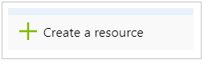
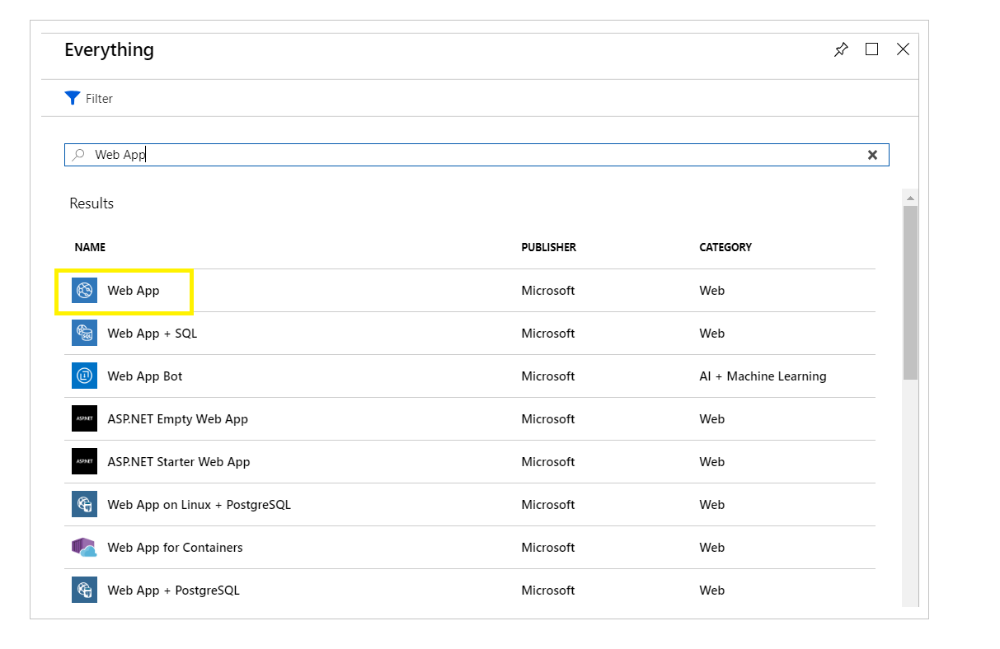
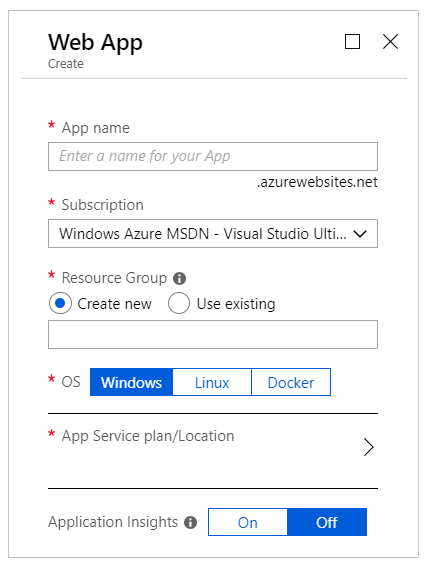

---
image:
  path: "/assets/2018-08-22-p1/windowsazure.jpg"
---

You want to host your ASP.NET Core Web app on Windows Azure and you have no clue where to start? 

This article presents providesa thorough guide on how to use the Azure Portal to create your Web app **Container** that will ultimately host your actual Web app.  

## Prerequisites
In this article I assume you are familiar with Azure App Service (aka Web Apps). If not, I recommend you start first by checking the official documentation for Azure App Service, on the Microsoft Docs website, to get yourself aquatinted with the theoretical knowledge on what is Azure App Service and what it can provide to you as a developer.

To access the Microsoft official documentation on Azure App Service, follow this link: [Azure App Service](https://docs.microsoft.com/en-us/azure/app-service/)

In addition, you need to have a valid Azure subscription. 

## Azure Portal

Microsoft provides the Azure Portal that plays the role of a Web Interface for all of the features that Azure contains. For this article and the coming ones in this series, I am going to use the **preview** version of the Azure Portal. This preview version was announced back in February 2017 here: [New Azure Preview Portal Grants Eary Access to Features](https://buildazure.com/2017/02/03/new-azure-preview-portal-grants-early-access-to-features/) 

To start with, go to [Azure Portal][https://preview.portal.azure.com/] and login with your credentials to access the portal.
 
## Create Web App Container

To host any Web app on the Azure Portal you start by creating a new resource of type Web App. 

1. Locate and click on **Create a resource** link at the top-left side of your screen.

   

1. The portal navigates you to the **Azure Marketplace** blade. You can then search for any resource type you are interested in creating. In this case, type **Web App** and hit *Enter* to start the search.

   

1. Locate and click on **Web App** resource type. The Web App documentation blade opens. 

1. Locate and click on the button **Create** and the Portal navigates you once again to the create new web app blade.

   

1. Give your app a name by filling in the **App name** field. In this case, I'm going to call this app **AnAppADay**. 

1. Select a valid subscription from the dropdown list field.

### Add a Resource Group

### Add an App Service Plan

## Create Staging Deployment Slot

### Set Deployment Credentials

### Set Deployment Source

## Summary